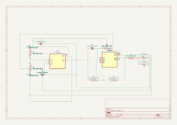

# Project 1 — KiCad Circuit and PCB Design

KiCad schematic and PCB layout files from Project 1 of my PCB design course.

## Design previews

### Schematic

[View the schematic as a PDF](previews/schematic.pdf).

### PCB layout

The schematic includes two **TL072CDR dual operational-amplifier packages**, two LEDs, resistors, capacitors, and test points. The circuit's intended function, assignment requirements, and hardware results are still to be documented.

## Source files

| File | Purpose |
| --- | --- |
| [project-1.kicad_pro](project-1.kicad_pro) | KiCad project settings |
| [project-1.kicad_sch](project-1.kicad_sch) | Editable circuit schematic |
| [project-1.kicad_pcb](project-1.kicad_pcb) | Editable PCB layout |

Open `project-1.kicad_pro` in KiCad to inspect the schematic and PCB. The included previews were exported with **KiCad 10.0.6**.

## Documentation to add

- Circuit objective and expected behavior
- My specific contribution and the assignment constraints
- Component-selection and PCB-routing decisions
- Fabrication details, board photos, and measured test results

[Return to PCB coursework](../../README.md)
