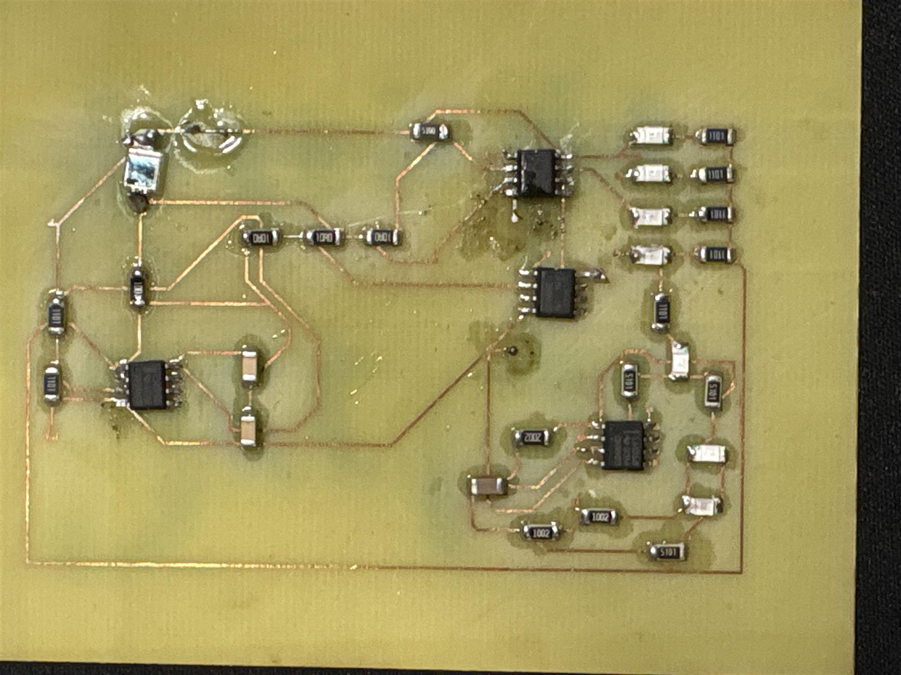

# Project 2 — Light-Sensing LED PCB

A light-sensing LED circuit built on a PCB for Project 2 of my PCB design course. The circuit responds to ambient room light and changes the LED behavior accordingly.

## Circuit behavior

- **Ambient-light response:** the circuit senses room light and turns on LEDs according to the detected light level.
- **Fully covered sensor:** when light to the sensor is completely blocked, two LEDs blink at **8 Hz**.

The 8 Hz blink rate is the reported project behavior; a waveform or timing measurement has not yet been uploaded.

## Assembled board

The board photograph shows copper traces and assembled surface-mount components, including integrated circuits, resistors, capacitors, and LEDs. It provides a visual record of the course project's hardware.

## Available artifacts

| Artifact | Status |
| --- | --- |
| Assembled PCB photograph | Included above |
| Circuit purpose | Ambient-light sensing with LED indication and an 8 Hz blinking response when the sensor is fully covered |
| My role in design, fabrication, and assembly | To be documented |
| Schematic and PCB layout source files | Not yet uploaded |
| Bill of materials | Not yet uploaded |
| Functional test procedure and measured results | Not yet uploaded |

## Documentation to add

- Document the sensor type, LED activation thresholds, blink-generation circuit, and assignment constraints.
- Describe my specific contributions and the tools and fabrication process used.
- Link the schematic, layout, and component list.
- Document the test setup, LED behavior at different light levels, measured blink frequency, and any troubleshooting or revisions.

[Return to PCB coursework](../../README.md)
